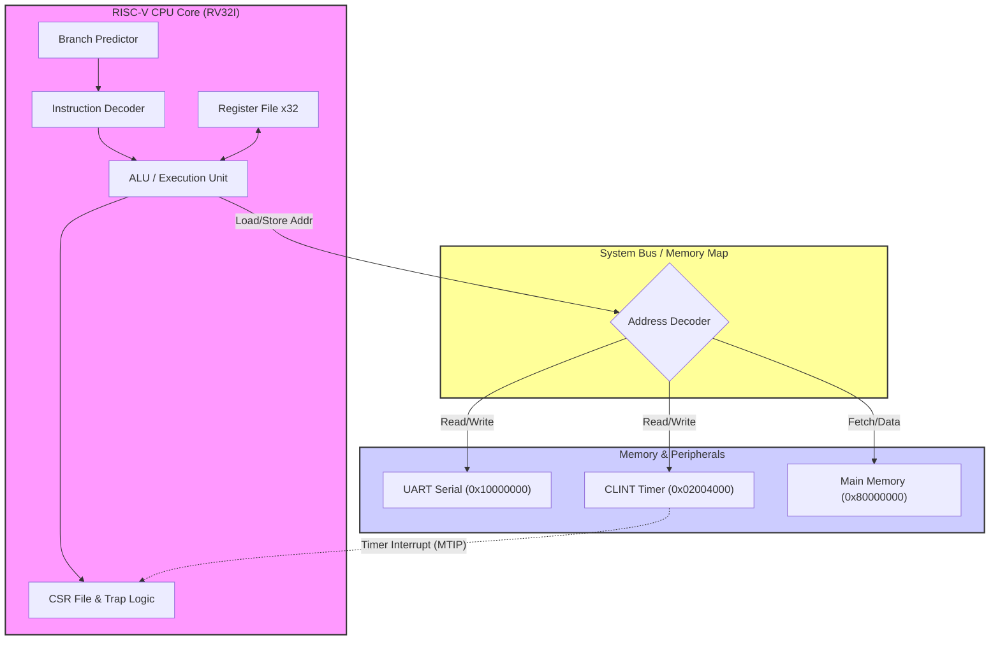

# 🚀 RV32I-Emulator: Cycle-Accurate RISC-V Core

A cycle-accurate **RISC-V Processor Emulator** implementing the **RV32I Base Integer ISA**, **Zicsr** extension, and a **Privileged Architecture** capable of booting bare-metal C programs with interrupts. 

Built from scratch in C++ to understand the micro-architectural details of modern processors, including pipeline simulation, branch prediction, and memory-mapped I/O.

---

## 🛠️ Key Features

### 1. Core Architecture
* **Instruction Set:** Full RV32I support (Load/Store, Arithmetic, Branching, Jumps).
* **System Control:** Implements **CSRs (Control Status Registers)** (`CSRRW`, `CSRRS`, `CSRRC`) for OS-level control.
* **Privileged Mode:** Supports **Machine Mode (M-Mode)** traps, exceptions, and interrupt handling.

### 2. Micro-Architecture
* **Branch Prediction:** Integrated **Branch Target Buffer (BTB)** to predict control flow and simulate pipeline efficiency.
* **Flight Recorder:** Circular trace buffer that dumps the last 100 executed instructions upon a crash (SegFault) for debugging.
* **Virtual Memory:** Simulated 64MB DRAM with strict permission checking (Read/Write/Execute).

### 3. Peripherals & MMIO
* **CLINT (Core Local Interruptor):** Implements `mtime` and `mtimecmp` registers for high-precision Timer Interrupts.
* **UART Console:** Memory-mapped serial I/O at `0x10000000` for standard output (printf support).

---

## 💻 Technical Details

### Memory Map
| Address Range | Device | Description |
| :--- | :--- | :--- |
| `0x00000000` - `0x02000000` | **Reserved** | Trap Vector & BootROM space |
| `0x02004000` - `0x0200BFFF` | **CLINT** | Timer Registers (mtime, mtimecmp) |
| `0x10000000` - `0x10000005` | **UART** | Serial Console (RX/TX) |
| `0x80000000` - `0x84000000` | **DRAM** | 64MB Main Memory (Program & Data) |


### Interrupt Logic
The emulator simulates the RISC-V **Trap Architecture**. When `mtime >= mtimecmp`:
1.  **Suspend:** Current execution pauses.
2.  **Context Save:** `PC` is saved to `mepc`.
3.  **Cause Update:** `mcause` is set to `0x80000007` (Machine Timer Interrupt).
4.  **Vector Jump:** CPU jumps to the address in `mtvec`.

---

## 🧪 Verification
Validated against a custom **Torture Test Suite** covering:
* ✅ Signed vs Unsigned Arithmetic Logic
* ✅ Little-Endian Memory Access Patterns
* ✅ Bitwise CSR Manipulation
* ✅ Recursive Stack Depth & Overflow
* ✅ Interrupt Context Switching & Return

## 🚀 Usage

### 1. Build the Emulator
```bash
g++ -o emulator src/main.cpp